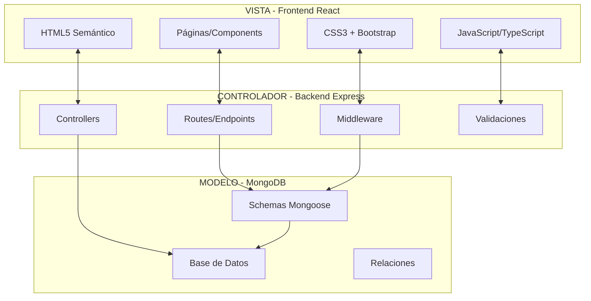
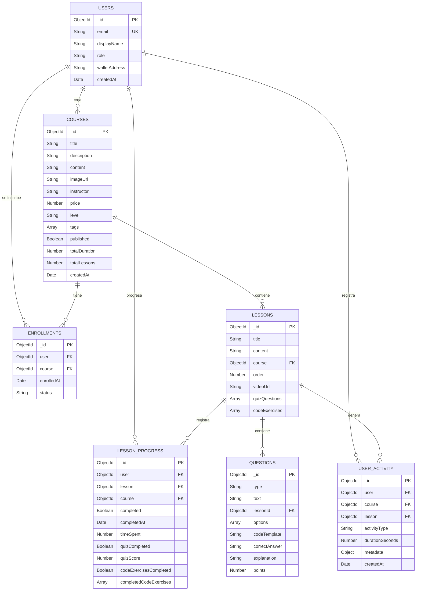

# 🎓 Plataforma de Aprendizaje Blockchain - Proyecto DAW

<div align="center">


**🌐 [DEMO EN VIVO](https://solanalearn.up.railway.app)** | **📁 [REPOSITORIO](https://github.com/vicrii/TFG)**

</div>

---

## 📋 Información

### 🔌 **Puertos y URLs**

| Servicio | Puerto | URL Local | URL Producción |
|----------|---------|-----------|----------------|
| **Frontend** | 5173 | http://localhost:5173 | https://solanalearn.up.railway.app |
| **Backend API** | 5000 | http://localhost:5000/api | https://solanalearn.up.railway.app/api

### 🚀 **Instrucciones de Uso**

#### **Con Docker (Recomendado)**
```bash
# 1. Clonar repositorio
git clone https://github.com/vicrii/TFG.git
cd TFG

# 2. Ejecutar con Docker
docker-compose up --build

# 3. Acceder: http://localhost:5173
```

#### **Manual**
```bash
# 1. Instalar dependencias
npm run install:all

# 2. Configurar .env
cp back/.env.example back/.env

# 3. Iniciar
npm run dev
```

## 🏗️ Arquitectura MVC

### **Patrón Modelo-Vista-Controlador**



### **Descripción de Capas**

#### **🎨 VISTA (Frontend)**
- **React 19**: Framework principal para interfaces dinámicas
- **TypeScript**: Tipado estático para mejor desarrollo
- **Bootstrap 5**: Framework CSS para responsive design
- **HTML5 semántico**: Estructura accesible
- **CSS3 moderno**: Animations, Grid, Flexbox, Custom Properties

#### **🎮 CONTROLADOR (Backend)**
- **Express.js**: Framework web para Node.js
- **REST API**: Endpoints estructurados siguiendo estándares
- **Middleware personalizado**: Autenticación, validación, CORS
- **Gestión de usuarios**: Sistema de login y permisos

#### **💾 MODELO (Datos)**
- **MongoDB**: Base de datos NoSQL para flexibilidad
- **Mongoose**: ODM para modelado de datos y relaciones
- **Schemas estructurados**: Validación y consistencia de datos

---

## 👥 Tipos de Usuarios y Operaciones

| Rol | Operaciones | Acceso |
|-----|-------------|--------|
| **👑 Admin** | • CRUD usuarios<br>• Gestión completa cursos<br>• Analytics globales<br>• Configuración sistema | Total |
| **👨‍🏫 Instructor** | • Crear/editar cursos<br>• Gestionar estudiantes<br>• Ver analytics propios | Cursos propios |
| **👨‍🎓 Estudiante** | • Ver cursos<br>• Completar lecciones<br>• Realizar evaluaciones | Cursos inscritos |

### **🔄 Flujos de Usuario Principales**

#### **Estudiante**
1. **Registro/Login** → Autenticación web o wallet
2. **Explorar Cursos** → Catálogo con filtros
3. **Inscribirse** → Proceso de matrícula
4. **Estudiar** → Lecciones, videos, ejercicios
5. **Evaluar** → Quizzes y proyectos
6. **Certificar** → Completar curso

#### **Instructor**
1. **Login** → Panel de instructor
2. **Crear Curso** → Editor avanzado
3. **Gestionar Contenido** → Lecciones, evaluaciones
4. **Monitorear** → Analytics y progreso

---

## 🗺️ Mapa de Navegación

```
🏠 HOME (/)
├── 📚 CURSOS (/courses)
│   ├── 🔍 Explorar (/courses/explore)
│   ├── 📋 Mi Aprendizaje (/my-courses)
│   └── 📖 Curso (/course/:id)
│       ├── 📄 Información
│       └── 📝 Lecciones (/course/:id/lesson/:number)
│
├── 👤 PERFIL (/profile)
│
├── 👨‍🏫 INSTRUCTOR (/instructor) [Instructor+]
│   ├── 📊 Dashboard
│   ├── ➕ Crear Curso
│   └── 📚 Mis Cursos
│
├── 🛠️ ADMIN (/admin) [Admin]
│   ├── 👥 Usuarios
│   ├── 📚 Cursos
│   └── 📊 Analytics
│
└── 🔐 LOGIN (/login)
```


## 🗃️ Diseño de Base de Datos

### **Diagrama E-R Simplificado**



### **Paso a Tablas (Colecciones MongoDB)**

#### **1. Colección: `users`**
```javascript
{
  _id: ObjectId,
  email: String, // único
  displayName: String,
  role: String, // 'admin', 'instructor', 'student'
  walletAddress: String, // único, opcional
  avatar: String,
  preferences: Object,
  createdAt: Date,
  updatedAt: Date,
  
  // Índices
  indexes: [
    { email: 1 }, // único
    { walletAddress: 1 }, // único, sparse
    { role: 1 }
  ]
}
```

#### **2. Colección: `courses`**
```javascript
{
  _id: ObjectId,
  title: String,
  description: String,
  content: String, // HTML contenido del curso
  imageUrl: String,
  instructor: String, // walletAddress del instructor
  price: Number,
  level: String, // 'beginner', 'intermediate', 'advanced'
  tags: [String],
  published: Boolean,
  totalDuration: Number, // duración en minutos
  totalLessons: Number,
  createdAt: Date,
  updatedAt: Date,
  
  // Índices
  indexes: [
    { instructor: 1 },
    { published: 1 },
    { level: 1 },
    { tags: 1 },
    { createdAt: -1 }
  ]
}
```

#### **3. Colección: `lessons`**
```javascript
{
  _id: ObjectId,
  title: String,
  content: String, // HTML contenido de la lección
  course: ObjectId, // ref: 'courses'
  order: Number,
  videoUrl: String,
  quizQuestions: [Object], // preguntas del quiz
  codeExercises: [Object], // ejercicios de código
  createdAt: Date,
  updatedAt: Date,
  
  // Índices
  indexes: [
    { course: 1, order: 1 },
    { course: 1 }
  ]
}
```

#### **4. Colección: `enrollments`**
```javascript
{
  _id: ObjectId,
  user: ObjectId, // ref: 'users'
  course: ObjectId, // ref: 'courses'
  enrolledAt: Date,
  status: String, // 'active', 'completed', 'dropped'
  createdAt: Date,
  updatedAt: Date,
  
  // Índices
  indexes: [
    { user: 1, course: 1 }, // único compuesto
    { user: 1 },
    { course: 1 },
    { status: 1 }
  ]
}
```

#### **5. Colección: `lessonprogress`**
```javascript
{
  _id: ObjectId,
  user: ObjectId, // ref: 'users'
  lesson: ObjectId, // ref: 'lessons'
  course: ObjectId, // ref: 'courses'
  completed: Boolean,
  completedAt: Date,
  timeSpent: Number, // tiempo en segundos
  notes: String,
  // Quiz específico
  quizCompleted: Boolean,
  quizCompletedAt: Date,
  quizScore: Number, // 0-100
  // Ejercicios de código específicos
  codeExercisesCompleted: Boolean,
  codeExercisesCompletedAt: Date,
  completedCodeExercises: [String], // IDs de ejercicios completados
  completedExercises: [{
    exerciseId: String,
    lessonId: String,
    completedAt: Date
  }],
  createdAt: Date,
  updatedAt: Date,
  
  // Índices
  indexes: [
    { user: 1, lesson: 1 }, // único compuesto
    { user: 1, course: 1 },
    { course: 1 },
    { completed: 1 }
  ]
}
```

#### **6. Colección: `useractivity`**
```javascript
{
  _id: ObjectId,
  user: ObjectId, // ref: 'users'
  course: ObjectId, // ref: 'courses'
  lesson: ObjectId, // ref: 'lessons'
  activityType: String, // 'lesson_viewed', 'lesson_completed', 'code_executed', 'simulator_used'
  durationSeconds: Number,
  metadata: Object, // datos adicionales específicos de la actividad
  createdAt: Date,
  
  // Índices
  indexes: [
    { user: 1, course: 1 },
    { user: 1, lesson: 1 },
    { user: 1, activityType: 1 },
    { course: 1, activityType: 1 },
    { createdAt: 1 }
  ]
}
```

#### **7. Colección: `questions`**
```javascript
{
  _id: ObjectId,
  type: String, // 'multiple_choice', 'text', 'code'
  text: String, // texto de la pregunta
  lessonId: ObjectId, // ref: 'lessons'
  options: [{ // para preguntas multiple choice
    text: String,
    isCorrect: Boolean
  }],
  codeTemplate: String, // plantilla para preguntas de código
  correctAnswer: String,
  explanation: String,
  points: Number,
  createdAt: Date,
  updatedAt: Date,
  
  // Índices
  indexes: [
    { lessonId: 1 },
    { type: 1 }
  ]
}
```

### **Relaciones y Constraints**

- **users.email**: Único, índice principal para autenticación
- **users.walletAddress**: Único sparse, permite autenticación Web3
- **enrollments**: Constraint único compuesto (user + course) - un usuario no puede inscribirse dos veces al mismo curso
- **lessonprogress**: Constraint único compuesto (user + lesson) - un usuario tiene un solo progreso por lección
- **courses.instructor**: Referencia al walletAddress en lugar de ObjectId para flexibilidad
- **Cascade deletes**: Se implementan a nivel de aplicación para mantener integridad referencial

---

## 🛠️ Stack Tecnológico

### **Frontend**
- **HTML5**: Estructura semántica
- **CSS3**: Estilos modernos + animaciones
- **React 19**: Framework interactivo
- **TypeScript**: Tipado estático
- **Bootstrap 5**: Framework responsive
- **Vite**: Build tool rápido

### **Backend**
- **Node.js 20**: Runtime JavaScript
- **Express.js**: Framework web
- **MongoDB**: Base de datos NoSQL
- **Mongoose**: ODM para MongoDB

### **DevOps**
- **Docker**: Containerización
- **Railway**: Hosting cloud
- **Nginx**: Servidor web
- **GitHub**: Control de versiones

---

## 📁 Estructura del Proyecto

```
📦 TFG/
├── 📂 front/                 # Frontend (VISTA)
│   ├── 📂 public/
│   │   └── index.html        # HTML5 principal
│   ├── 📂 src/
│   │   ├── 📂 components/    # Componentes React
│   │   ├── 📂 pages/         # Páginas principales
│   │   ├── 📂 services/      # API client
│   │   └── 📂 styles/        # CSS3 + Bootstrap
│   └── package.json
│
├── 📂 back/                  # Backend (CONTROLADOR + MODELO)
│   ├── 📂 src/
│   │   ├── 📂 routes/        # Endpoints API
│   │   ├── 📂 controllers/   # Lógica de negocio
│   │   ├── 📂 models/        # Esquemas MongoDB
│   │   └── 📂 middleware/    # Validaciones
│   ├── server.ts             # Servidor Express
│   └── package.json
│
├── docker-compose.yml        # Orquestación
└── README.md                 # Documentación principal
```

---

## 🚀 Instalación

### **Opción 1: Docker**
```bash
git clone https://github.com/vicrii/TFG.git
cd TFG
docker-compose up --build
```

### **Opción 2: Manual**
```bash
# 1. Clonar
git clone https://github.com/vicrii/TFG.git
cd TFG

# 2. Instalar
npm run install:all

# 3. Configurar
cp back/.env.example back/.env
# Editar variables de entorno

# 4. Ejecutar
npm run dev
```

---

## 🔗 Enlaces Importantes

- **🌐 Demo**: https://solanalearn.up.railway.app
- **📂 Repositorio**: https://github.com/vicrii/TFG

---

## 📄 Licencia

MIT License - Ver [LICENSE](LICENSE) para más detalles.

---

<div align="center">

**🎓 Proyecto Final DAW - Desarrollo de Aplicaciones Web**


**[🚀 Demo](https://solanalearn.up.railway.app)**

</div> 
