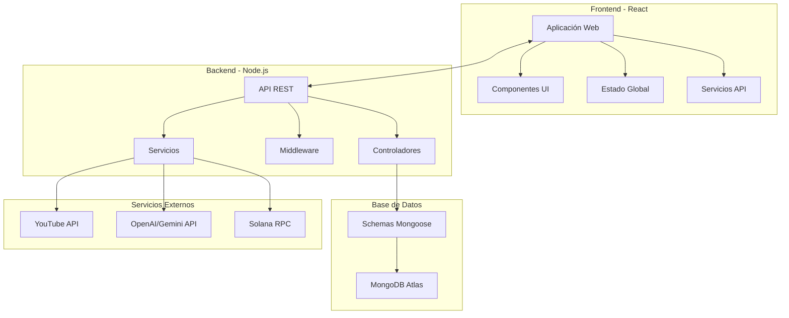

# 🎓 Plataforma de Aprendizaje Blockchain

<div align="center">


*Una plataforma educativa revolucionaria que integra blockchain, IA generativa y tecnologías web modernas para crear experiencias de aprendizaje inmersivas.*

</div>

## 🌟 Características Principales

### 🔐 **Autenticación Blockchain**
- Integración con wallets Solana (Phantom, Solflare, etc.)
- Autenticación descentralizada sin contraseñas
- Gestión segura de identidad digital

### 🎯 **Sistema de Cursos Inteligente**
- **Creación automática de cursos** desde videos de YouTube
- **Generación de contenido con IA** (GPT-4, Gemini)
- **Editor de código integrado** con Monaco Editor
- **Sistema de evaluaciones** con preguntas automáticas
- **Ejercicios de programación** con casos de prueba

### 💡 **IA Generativa Integrada**
- Transcripción automática de videos
- Generación de lecciones estructuradas
- Creación de preguntas de evaluación
- Ejercicios de código personalizados
- Análisis de contenido y sugerencias

### 📊 **Analytics Avanzado**
- Seguimiento de progreso en tiempo real
- Métricas de aprendizaje detalladas
- Dashboard para instructores
- Análisis de rendimiento estudiantil

### 🎨 **Experiencia de Usuario Premium**
- Interfaz moderna con temas personalizables
- Modo oscuro/claro automático
- Diseño responsive para todos los dispositivos
- Accesibilidad optimizada

## 🏗️ Arquitectura del Sistema



## 🚀 Stack Tecnológico

### **Frontend**
| Tecnología | Versión | Propósito |
|------------|---------|-----------|
| React | 19.x | Framework principal |
| TypeScript | 5.x | Tipado estático |
| Vite | 5.x | Build tool y dev server |
| Bootstrap | 5.x | Framework CSS |
| Monaco Editor | - | Editor de código |
| Solana Web3.js | - | Integración blockchain |
| Chart.js | - | Visualización de datos |
| React Router | 6.x | Navegación SPA |

### **Backend**
| Tecnología | Versión | Propósito |
|------------|---------|-----------|
| Node.js | 20.x | Runtime JavaScript |
| Express.js | 4.x | Framework web |
| TypeScript | 5.x | Tipado estático |
| MongoDB | 7.x | Base de datos |
| Mongoose | 8.x | ODM para MongoDB |
| OpenAI API | - | IA generativa |
| Google Gemini | - | IA generativa alternativa |
| YouTube API | v3 | Procesamiento de videos |

### **DevOps & Deployment**
| Tecnología | Propósito |
|------------|-----------|
| Docker | Containerización |
| Railway | Hosting y CI/CD |
| MongoDB Atlas | Base de datos cloud |
| PowerShell Scripts | Automatización |

## 📁 Estructura del Proyecto

```
📦 plataforma-educativa/
├── 📂 front/                     # Frontend React
│   ├── 📂 src/
│   │   ├── 📂 components/        # Componentes reutilizables
│   │   │   ├── 📂 courses/       # Gestión de cursos
│   │   │   ├── 📂 lesson/        # Reproductor de lecciones
│   │   │   ├── 📂 auth/          # Autenticación
│   │   │   ├── 📂 wallet/        # Integración blockchain
│   │   │   ├── 📂 analytics/     # Dashboard y métricas
│   │   │   └── 📂 interactive/   # Editor de código
│   │   ├── 📂 pages/             # Páginas principales
│   │   ├── 📂 services/          # API y servicios
│   │   ├── 📂 hooks/             # Custom hooks
│   │   ├── 📂 context/           # Contextos React
│   │   └── 📂 types/             # Tipos TypeScript
│   └── 📂 public/                # Assets estáticos
├── 📂 back/                      # Backend Node.js
│   ├── 📂 src/
│   │   ├── 📂 routes/            # Rutas API
│   │   ├── 📂 controllers/       # Lógica de negocio
│   │   ├── 📂 services/          # Servicios externos
│   │   ├── 📂 models/            # Modelos MongoDB
│   │   └── 📂 types/             # Tipos TypeScript
│   └── 📂 db/                    # Configuración BD
├── 📂 docs/                      # Documentación detallada
└── 📂 deployment/                # Scripts y configuraciones
```

## 🎯 Funcionalidades Clave

### 🎥 **Generación Automática de Cursos**
1. **Desde YouTube**: Introduce una URL y la IA genera un curso completo
2. **Desde Texto**: Convierte cualquier texto en lecciones estructuradas
3. **Configuración Avanzada**: Personaliza tipo de contenido, dificultad y número de lecciones

### 📚 **Sistema de Lecciones**
- **Contenido HTML Rico**: Editor WYSIWYG para contenido multimedia
- **Videos Integrados**: Reproductor nativo con controles avanzados
- **Código Interactivo**: Editor con resaltado de sintaxis y autocompletado
- **Evaluaciones**: Quizzes automáticos con retroalimentación

### 👥 **Gestión de Usuarios**
- **Roles Dinámicos**: Estudiante, Instructor, Moderador, Admin
- **Perfiles Personalizables**: Avatar, bio, preferencias
- **Progreso Detallado**: Seguimiento granular de avance

### 📈 **Analytics y Reporting**
- **Dashboard del Estudiante**: Progreso, tiempo invertido, logros
- **Panel del Instructor**: Métricas de cursos, engagement, feedback
- **Analytics Administrativo**: Uso de plataforma, tendencias, reportes

## 🛠️ Instalación y Configuración

### **Requisitos Previos**
- Node.js 20.x o superior
- MongoDB 7.x (local o Atlas)
- Git
- NPM o Yarn

### **Instalación Rápida**

```bash
# 1. Clonar el repositorio
git clone https://github.com/tu-usuario/plataforma-educativa.git
cd plataforma-educativa

# 2. Instalar todas las dependencias
npm run install:all

# 3. Configurar variables de entorno
cp back/.env.example back/.env
# Editar back/.env con tus configuraciones

# 4. Iniciar en modo desarrollo
npm run dev
```

### **URLs de Desarrollo**
- **Frontend**: http://localhost:5173
- **Backend API**: http://localhost:5000
- **Documentación API**: http://localhost:5000/api-docs

## 🔧 Variables de Entorno

### **Backend (.env)**
```env
# Base de datos
MONGODB_URI=mongodb://localhost:27017/plataforma-educativa
MONGODB_URI_ATLAS=mongodb+srv://...

# APIs Externas
OPENAI_API_KEY=sk-...
GOOGLE_API_KEY=...
YOUTUBE_API_KEY=...

# Configuración del servidor
PORT=5000
NODE_ENV=development

# Seguridad
JWT_SECRET=tu-secreto-jwt
CORS_ORIGIN=http://localhost:5173
```

### **Frontend (.env)**
```env
VITE_API_URL=http://localhost:5000/api
VITE_SOLANA_NETWORK=devnet
VITE_APP_NAME=Plataforma Educativa
```

## 📖 Documentación Detallada

| Sección | Descripción | Link |
|---------|-------------|------|
| 🚀 **Getting Started** | Guía completa de instalación y configuración | [📖 Ver docs](docs/getting-started/README.md) |
| 🏗️ **Arquitectura** | Diseño del sistema y patrones utilizados | [📖 Ver docs](docs/architecture/README.md) |
| 🔌 **API Reference** | Documentación completa de endpoints | [📖 Ver docs](docs/api/README.md) |
| 👨‍💻 **Development** | Guías para desarrolladores | [📖 Ver docs](docs/development/README.md) |
| 🎯 **User Manual** | Manual de usuario para estudiantes e instructores | [📖 Ver docs](docs/user-manual/README.md) |
| 🚀 **Deployment** | Guías de despliegue en diferentes plataformas | [📖 Ver docs](docs/deployment/README.md) |
| 🧪 **Testing** | Estrategias y guías de testing | [📖 Ver docs](docs/testing/README.md) |

## 🚀 Despliegue

### **Railway (Recomendado)**
```bash
# Deploy directo
npm run deploy:railway

# O usar el script personalizado
./deploy-railway.ps1
```

### **Docker**
```bash
# Build y ejecutar
docker-compose up --build

# Para producción
docker-compose -f docker-compose.yml up -d
```

### **AWS/Azure/GCP**
Ver la [guía de deployment](docs/deployment/README.md) para instrucciones específicas.

## 🧪 Testing

```bash
# Tests del frontend
cd front && npm test

# Tests del backend
cd back && npm test

# Tests de integración
npm run test:integration

# Coverage
npm run test:coverage
```

## 🤝 Contribuir

1. Fork el proyecto
2. Crea una feature branch (`git checkout -b feature/nueva-funcionalidad`)
3. Commit tus cambios (`git commit -m 'Agregar nueva funcionalidad'`)
4. Push a la branch (`git push origin feature/nueva-funcionalidad`)
5. Abre un Pull Request

Ver [CONTRIBUTING.md](CONTRIBUTING.md) para más detalles.

## 📄 Licencia

Este proyecto está licenciado bajo la Licencia MIT - ver el archivo [LICENSE](LICENSE) para más detalles.

## 🙋‍♂️ Soporte y Comunidad

- 📧 **Email**: soporte@plataforma-educativa.com
- 💬 **Discord**: [Únete a nuestra comunidad](https://discord.gg/plataforma-educativa)
- 🐦 **Twitter**: [@PlataformaEdu](https://twitter.com/PlataformaEdu)
- 📝 **Issues**: [GitHub Issues](https://github.com/tu-usuario/plataforma-educativa/issues)
- 📚 **Wiki**: [GitHub Wiki](https://github.com/tu-usuario/plataforma-educativa/wiki)

## 🏆 Agradecimientos

- **OpenAI** por la API de GPT
- **Google** por Gemini API
- **Solana** por la infraestructura blockchain
- **MongoDB** por la base de datos
- **Railway** por el hosting
- **Comunidad Open Source** por las librerías utilizadas

---

<div align="center">

**¿Te gusta el proyecto? ¡Dale una ⭐!**

[🚀 Empezar Ahora](docs/getting-started/README.md) | [📖 Documentación](docs/) | [🐛 Reportar Bug](https://github.com/tu-usuario/plataforma-educativa/issues)

</div> 