# 🏗️ Arquitectura del Sistema - Plataforma Educativa

Esta documentación describe la arquitectura completa de la Plataforma de Aprendizaje Blockchain, incluyendo patrones de diseño, decisiones técnicas y la interacción entre componentes.

## 🎯 Visión General del Sistema

La plataforma está diseñada como una **aplicación web fullstack moderna** que integra:

- 🎓 **Sistema educativo** con cursos y lecciones
- 🤖 **Inteligencia artificial** para generación de contenido
- 🔗 **Blockchain** para autenticación y pagos
- 📊 **Analytics** para seguimiento de progreso
- 🎨 **UI/UX** moderna y responsive

## 🔧 Arquitectura de Alto Nivel


## 🎯 Patrones Arquitectónicos

### **1. Clean Architecture**
```
📁 Estructura por Capas
├── 🎨 Presentation Layer (Frontend)
│   ├── Components (UI)
│   ├── Pages (Views)
│   └── Hooks (State Logic)
├── 🔌 API Layer (Controllers)
│   ├── Routes (Endpoints)
│   ├── Middleware (Auth, CORS, etc.)
│   └── Validation (Request/Response)
├── 💼 Business Layer (Services)
│   ├── Course Service
│   ├── AI Service
│   └── Analytics Service
└── 💾 Data Layer (Models)
    ├── MongoDB Models
    └── External APIs
```

### **2. Microservices-Ready**
Aunque actualmente es un monolito, está diseñado para migrar fácilmente a microservicios:

```mermaid
graph LR
    subgraph "Servicios Actuales (Monolito)"
        Auth_S[Auth Service]
        Course_S[Course Service]
        AI_S[AI Service]
        Analytics_S[Analytics Service]
    end
    
    subgraph "Futuro: Microservicios"
        Auth_MS[🔐 Auth Service]
        Course_MS[📚 Course Service]
        AI_MS[🤖 AI Service]
        Analytics_MS[📊 Analytics Service]
        Gateway_MS[🌐 API Gateway]
    end
    
    Auth_S -.->|Migration Path| Auth_MS
    Course_S -.->|Migration Path| Course_MS
    AI_S -.->|Migration Path| AI_MS
    Analytics_S -.->|Migration Path| Analytics_MS
```



### **3. Event-Driven Architecture**
Para operaciones asíncronas y desacoplamiento:

```javascript
// Ejemplo: Sistema de eventos
class EventBus {
  private listeners = new Map();
  
  emit(event: string, data: any) {
    const handlers = this.listeners.get(event) || [];
    handlers.forEach(handler => handler(data));
  }
  
  on(event: string, handler: Function) {
    if (!this.listeners.has(event)) {
      this.listeners.set(event, []);
    }
    this.listeners.get(event).push(handler);
  }
}

// Uso en servicios
eventBus.emit('course.created', { courseId, instructorId });
eventBus.emit('lesson.completed', { lessonId, studentId });
```

## 🎨 Arquitectura del Frontend

### **Estructura de Componentes**
```
front/src/
├── 📱 components/
│   ├── 🏠 home/              # Página principal
│   ├── 📚 courses/           # Gestión de cursos
│   ├── 📖 lesson/            # Reproductor de lecciones
│   ├── 🔐 auth/              # Autenticación
│   ├── 💰 wallet/            # Integración blockchain
│   ├── 📊 analytics/         # Dashboard y métricas
│   ├── 🎮 interactive/       # Editor de código
│   ├── 🎨 layout/            # Layout components
│   └── ⚙️ common/            # Componentes reutilizables
├── 📄 pages/                 # Páginas principales
├── 🔧 services/              # Servicios y APIs
├── 🪝 hooks/                 # Custom React hooks
├── 🌐 context/               # Contextos globales
└── 📝 types/                 # Tipos TypeScript
```

### **Gestión de Estado**

```mermaid
graph TB
    subgraph "Estado Global"
        AuthContext[👤 Auth Context]
        ThemeContext[🎨 Theme Context]
        CourseContext[📚 Course Context]
        WalletContext[💰 Wallet Context]
    end
    
    subgraph "Estado Local"
        Component1[Component State]
        Component2[Custom Hooks]
        Component3[Reducer Hooks]
    end
    
    subgraph "Estado Servidor"
        ReactQuery[React Query Cache]
        LocalStorage[Local Storage]
        SessionStorage[Session Storage]
    end
    
    AuthContext --> Component1
    ThemeContext --> Component2
    CourseContext --> Component3
    
    Component1 --> ReactQuery
    Component2 --> LocalStorage
    Component3 --> SessionStorage
```


### **Patrón de Servicios**
```typescript
// Ejemplo: API Client con interceptors
class ApiClient {
  private client: AxiosInstance;
  
  constructor() {
    this.client = axios.create({
      baseURL: this.getApiUrl(),
      timeout: 10000
    });
    
    this.setupInterceptors();
  }
  
  private setupInterceptors() {
    // Request interceptor para auth
    this.client.interceptors.request.use(
      (config) => {
        const walletAddress = getWalletAddress();
        if (walletAddress) {
          config.headers['x-wallet-address'] = walletAddress;
        }
        return config;
      }
    );
    
    // Response interceptor para errores
    this.client.interceptors.response.use(
      (response) => response.data,
      (error) => {
        if (error.response?.status === 401) {
          // Redirect to wallet connect
        }
        return Promise.reject(error);
      }
    );
  }
}
```

## 🔧 Arquitectura del Backend

### **Estructura de Servicios**
```
back/src/
├── 🛣️ routes/               # Definición de rutas
│   ├── auth.routes.ts
│   ├── course.routes.ts
│   ├── lesson.routes.ts
│   ├── analytics.routes.ts
│   └── transcription.routes.ts
├── 🎮 controllers/          # Lógica de controladores
│   ├── CourseController.ts
│   ├── LessonController.ts
│   └── AnalyticsController.ts
├── 💼 services/             # Lógica de negocio
│   ├── CourseService.ts
│   ├── AIService.ts
│   └── AnalyticsService.ts
├── 🗄️ models/              # Modelos de datos
│   ├── User.ts
│   ├── Course.ts
│   └── Lesson.ts
└── 🔧 types/               # Tipos TypeScript
```

### **Patrón Repository**
```typescript
// Interfaz genérica
interface IRepository<T> {
  create(data: Partial<T>): Promise<T>;
  findById(id: string): Promise<T | null>;
  findMany(filter: any): Promise<T[]>;
  update(id: string, data: Partial<T>): Promise<T>;
  delete(id: string): Promise<boolean>;
}

// Implementación específica
class CourseRepository implements IRepository<ICourse> {
  async create(courseData: Partial<ICourse>): Promise<ICourse> {
    const course = new Course(courseData);
    return await course.save();
  }
  
  async findById(id: string): Promise<ICourse | null> {
    return await Course.findById(id)
      .populate('instructor', 'displayName avatar')
      .exec();
  }
  
  // ... más métodos
}

// Servicio que usa el repository
class CourseService {
  constructor(private courseRepo: CourseRepository) {}
  
  async createCourse(data: ICourseData, instructorId: string) {
    // Validación de negocio
    if (!data.title || data.title.length < 3) {
      throw new ValidationError('Title too short');
    }
    
    // Crear curso
    const course = await this.courseRepo.create({
      ...data,
      instructor: instructorId,
      createdAt: new Date()
    });
    
    // Eventos
    eventBus.emit('course.created', { courseId: course._id });
    
    return course;
  }
}
```

### **Middleware Pipeline**
```typescript
// Pipeline de middleware para requests
app.use(cors(corsOptions));                    // 1. CORS
app.use(helmet());                             // 2. Security headers
app.use(express.json({ limit: '10mb' }));      // 3. Body parser
app.use(rateLimiter);                          // 4. Rate limiting
app.use(requestLogger);                        // 5. Logging
app.use('/api', authMiddleware);               // 6. Authentication
app.use('/api', validationMiddleware);         // 7. Request validation
app.use('/api', routes);                       // 8. Business logic
app.use(errorHandler);                         // 9. Error handling
```

## 💾 Arquitectura de Datos

### **Modelo de Datos - MongoDB**


### **Índices y Optimización**
```typescript
// Índices para performance
const userSchema = new Schema({
  walletAddress: { 
    type: String, 
    required: true, 
    unique: true,
    index: true  // 🔍 Búsqueda rápida por wallet
  },
  email: { 
    type: String, 
    index: true  // 🔍 Búsqueda por email
  }
});

const courseSchema = new Schema({
  instructor: { 
    type: ObjectId, 
    ref: 'User',
    index: true  // 🔍 Cursos por instructor
  },
  published: { 
    type: Boolean, 
    index: true  // 🔍 Solo cursos públicos
  },
  tags: [{ 
    type: String, 
    index: true  // 🔍 Búsqueda por tags
  }],
  createdAt: { 
    type: Date, 
    index: -1    // 🔍 Ordenar por fecha (desc)
  }
});

// Índice compuesto para queries complejas
courseSchema.index({ 
  published: 1, 
  level: 1, 
  tags: 1 
});
```

### **Estrategia de Cache**
```typescript
// Redis cache para datos frecuentes
class CacheService {
  async getCoursesList(filters: any): Promise<ICourse[]> {
    const cacheKey = `courses:${JSON.stringify(filters)}`;
    
    // Intentar desde cache
    const cached = await redis.get(cacheKey);
    if (cached) {
      return JSON.parse(cached);
    }
    
    // Si no está en cache, obtener de DB
    const courses = await Course.find(filters).lean();
    
    // Guardar en cache por 5 minutos
    await redis.setex(cacheKey, 300, JSON.stringify(courses));
    
    return courses;
  }
  
  async invalidateCourseCache(courseId: string) {
    // Invalidar cache relacionado cuando hay cambios
    const pattern = `courses:*`;
    const keys = await redis.keys(pattern);
    if (keys.length > 0) {
      await redis.del(...keys);
    }
  }
}
```

## 🤖 Integración de IA

### **Arquitectura de Servicios de IA**


### **Patrón Strategy para Proveedores de IA**
```typescript
interface IAIProvider {
  generateContent(prompt: string, options?: any): Promise<string>;
  generateQuiz(content: string): Promise<QuizQuestion[]>;
  generateCode(description: string, language: string): Promise<CodeExercise>;
}

class OpenAIProvider implements IAIProvider {
  async generateContent(prompt: string): Promise<string> {
    const response = await this.openai.chat.completions.create({
      model: "gpt-4",
      messages: [{ role: "user", content: prompt }],
      temperature: 0.7
    });
    
    return response.choices[0].message.content;
  }
}

class GeminiProvider implements IAIProvider {
  async generateContent(prompt: string): Promise<string> {
    const model = this.genai.getGenerativeModel({ model: "gemini-pro" });
    const result = await model.generateContent(prompt);
    return result.response.text();
  }
}

// Selector de proveedor con fallback
class AIService {
  private providers: IAIProvider[] = [
    new OpenAIProvider(),
    new GeminiProvider()
  ];
  
  async generateContent(prompt: string): Promise<string> {
    for (const provider of this.providers) {
      try {
        return await provider.generateContent(prompt);
      } catch (error) {
        console.warn(`Provider failed, trying next: ${error.message}`);
        continue;
      }
    }
    
    throw new Error('All AI providers failed');
  }
}
```

## 🔗 Integración Blockchain

### **Arquitectura Wallet**


### **Autenticación Sin Contraseña**
```typescript
// Frontend: Conectar wallet
const connectWallet = async () => {
  try {
    const { publicKey } = await wallet.connect();
    
    // Verificar en backend
    const response = await apiClient.post('/auth/verify-wallet', {
      publicKey: publicKey.toString()
    });
    
    if (response.success) {
      setUser(response.user);
    }
  } catch (error) {
    console.error('Wallet connection failed:', error);
  }
};

// Backend: Middleware de autenticación
const authMiddleware = async (req, res, next) => {
  const walletAddress = req.headers['x-wallet-address'];
  
  if (!walletAddress) {
    return res.status(401).json({ error: 'Wallet address required' });
  }
  
  // Validar formato de dirección Solana
  if (!isValidSolanaAddress(walletAddress)) {
    return res.status(401).json({ error: 'Invalid wallet address' });
  }
  
  // Buscar o crear usuario
  let user = await User.findOne({ walletAddress });
  if (!user) {
    user = await User.create({ 
      walletAddress,
      role: 'student',
      createdAt: new Date()
    });
  }
  
  req.user = user;
  next();
};
```

## 📊 Arquitectura de Analytics

### **Pipeline de Datos**


### **Métricas en Tiempo Real**
```typescript
class AnalyticsService {
  async trackEvent(event: AnalyticsEvent) {
    // Guardar evento raw
    await this.saveRawEvent(event);
    
    // Actualizar métricas en tiempo real
    await this.updateRealTimeMetrics(event);
    
    // Procesar agregaciones
    this.processAggregations(event);
  }
  
  private async updateRealTimeMetrics(event: AnalyticsEvent) {
    switch (event.type) {
      case 'lesson_completed':
        await this.incrementUserProgress(event.userId, event.courseId);
        await this.updateCourseStats(event.courseId);
        break;
        
      case 'quiz_completed':
        await this.updateQuizStats(event.quizId, event.score);
        break;
    }
  }
  
  async getUserDashboard(userId: string): Promise<UserDashboard> {
    const [
      enrolledCourses,
      completedLessons,
      totalTimeSpent,
      achievements
    ] = await Promise.all([
      this.getEnrolledCourses(userId),
      this.getCompletedLessons(userId),
      this.getTotalTimeSpent(userId),
      this.getUserAchievements(userId)
    ]);
    
    return {
      enrolledCourses: enrolledCourses.length,
      completedCourses: enrolledCourses.filter(c => c.completed).length,
      completedLessons: completedLessons.length,
      totalTimeSpent,
      achievements
    };
  }
}
```

## 🔒 Seguridad

### **Capas de Seguridad**


### **Implementación de Seguridad**
```typescript
// Content Security Policy
app.use(helmet({
  contentSecurityPolicy: {
    directives: {
      defaultSrc: ["'self'"],
      scriptSrc: ["'self'", "'unsafe-inline'", "https://cdnjs.cloudflare.com"],
      styleSrc: ["'self'", "'unsafe-inline'", "https://fonts.googleapis.com"],
      fontSrc: ["'self'", "https://fonts.gstatic.com"],
      imgSrc: ["'self'", "data:", "https:"],
      connectSrc: ["'self'", "https://api.openai.com", "https://api.solana.com"]
    }
  }
}));

// Rate limiting por endpoint
const createRateLimit = (windowMs: number, max: number) => 
  rateLimit({
    windowMs,
    max,
    message: 'Too many requests',
    standardHeaders: true,
    legacyHeaders: false
  });

app.use('/api/auth', createRateLimit(15 * 60 * 1000, 5)); // 5 per 15min
app.use('/api/courses', createRateLimit(15 * 60 * 1000, 100)); // 100 per 15min
app.use('/api/generate', createRateLimit(60 * 60 * 1000, 10)); // 10 per hour

// Input sanitization
const sanitizeInput = (req: Request, res: Response, next: NextFunction) => {
  if (req.body) {
    req.body = sanitizeObject(req.body);
  }
  if (req.query) {
    req.query = sanitizeObject(req.query);
  }
  next();
};

function sanitizeObject(obj: any): any {
  if (typeof obj === 'string') {
    return validator.escape(obj);
  }
  if (typeof obj === 'object' && obj !== null) {
    const sanitized: any = {};
    for (const key in obj) {
      sanitized[key] = sanitizeObject(obj[key]);
    }
    return sanitized;
  }
  return obj;
}
```

## 📈 Escalabilidad y Performance

### **Estrategias de Escalabilidad**


### **Optimizaciones de Performance**
```typescript
// Lazy loading de componentes
const CourseDetail = lazy(() => import('./pages/CourseDetail'));
const LessonPlayer = lazy(() => import('./components/LessonPlayer'));

// Memoización de componentes pesados
const ExpensiveComponent = memo(({ data }) => {
  const processedData = useMemo(() => 
    expensiveProcessing(data), [data]
  );
  
  return <div>{processedData}</div>;
});

// Paginación eficiente en backend
class PaginationService {
  static async paginate<T>(
    model: Model<T>,
    query: any,
    options: PaginationOptions
  ): Promise<PaginatedResult<T>> {
    const { page = 1, limit = 10, sort = '-createdAt' } = options;
    const skip = (page - 1) * limit;
    
    const [data, total] = await Promise.all([
      model.find(query)
        .sort(sort)
        .skip(skip)
        .limit(limit)
        .lean(),
      model.countDocuments(query)
    ]);
    
    return {
      data,
      pagination: {
        current: page,
        total: Math.ceil(total / limit),
        hasNext: skip + limit < total,
        hasPrev: page > 1
      }
    };
  }
}

// Compression middleware
app.use(compression({
  filter: (req, res) => {
    if (req.headers['x-no-compression']) {
      return false;
    }
    return compression.filter(req, res);
  },
  level: 6,
  threshold: 1024
}));
```

## 🔄 CI/CD y DevOps

### **Pipeline de Desarrollo**


### **Automatización con Railway**
```yaml
# railway.toml
[build]
builder = "dockerfile"
dockerfilePath = "Dockerfile.simple"

[deploy]
startCommand = "node dist/server.js"
healthcheckPath = "/api/health"
healthcheckTimeout = 300
restartPolicyType = "always"

[environment]
# Variables se configuran en Railway Dashboard
```

## 📚 Documentación Adicional

Para profundizar en aspectos específicos:

- **[Database Design](./database.md)** - Esquemas y modelos detallados
- **[API Design](./api-design.md)** - Patrones y convenciones de API
- **[Frontend Architecture](./frontend.md)** - Componentes y estado
- **[Security](./security.md)** - Implementación de seguridad
- **[Performance](./performance.md)** - Optimizaciones y monitoreo

---

## 🎯 Decisiones Arquitectónicas

### **¿Por qué estas tecnologías?**

| Decisión | Razón | Alternativas Consideradas |
|----------|-------|---------------------------|
| **React 19** | Ecosystem maduro, performance, developer experience | Vue.js, Angular, Svelte |
| **Node.js** | JavaScript unificado, ecosystem NPM, performance | Python/Django, Go, Rust |
| **MongoDB** | Flexibilidad de esquemas, escalabilidad horizontal | PostgreSQL, MySQL |
| **TypeScript** | Type safety, mejor DX, mantenibilidad | JavaScript puro |
| **Railway** | Simplicidad, costo-efectivo, integración Git | Heroku, Vercel, AWS |
| **Solana** | Performance, bajos costos, ecosystem creciente | Ethereum, Polygon |

### **Trade-offs Importantes**

| Aspecto | Ventaja | Desventaja |
|---------|---------|------------|
| **Monolito inicial** | Simplicidad de deployment | Potencial acoplamiento |
| **NoSQL (MongoDB)** | Flexibilidad de esquemas | Menos ACID compliance |
| **Client-side auth** | UX fluida | Seguridad en el cliente |
| **AI externa** | Capabilities avanzadas | Dependencia externa, costos |

---

**¿Tienes preguntas sobre la arquitectura?** 

📧 Contacta al equipo: architecture@plataforma-educativa.com 