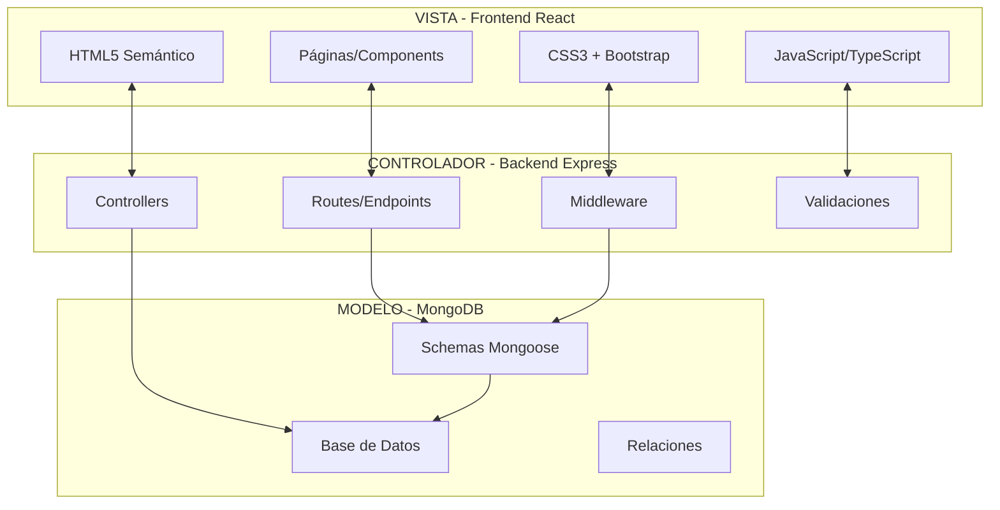
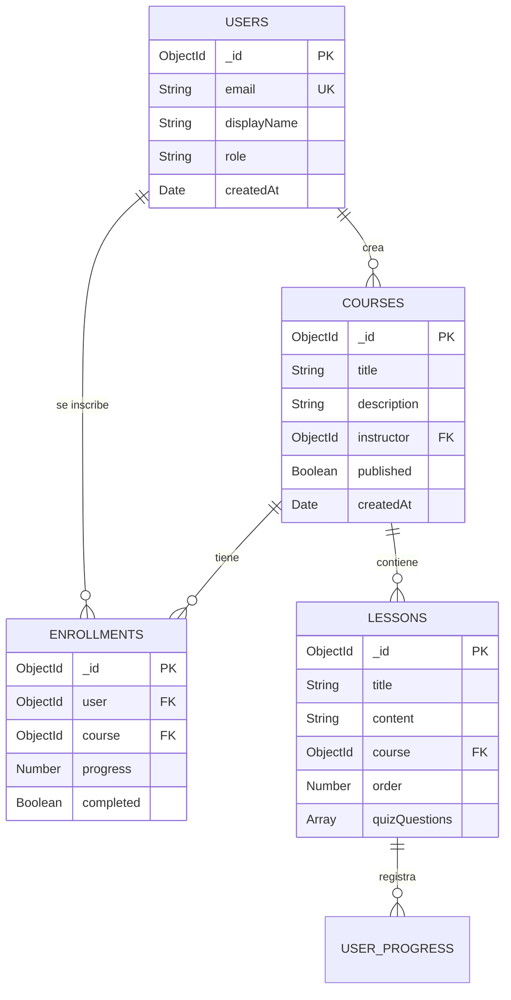

# 🎓 Plataforma de Aprendizaje Blockchain - Proyecto DAW

<div align="center">


**🌐 [DEMO EN VIVO](https://solanalearn.up.railway.app)** | **📁 [REPOSITORIO](https://github.com/vicrii/TFG)**

</div>

---

## 📋 Información de Entrega DAW

### 🎯 **Credenciales de Acceso**

| Tipo de Usuario | Email/Wallet | Contraseña | Permisos |
|----------------|--------------|------------|----------|
| **Administrador** | `admin@plataforma.com` | `admin123` | Gestión completa del sistema |
| **Instructor** | `instructor@plataforma.com` | `instructor123` | Crear y gestionar cursos |
| **Estudiante** | `estudiante@plataforma.com` | `estudiante123` | Acceder a cursos y lecciones |

### 🔌 **Puertos y URLs**

| Servicio | Puerto | URL Local | URL Producción |
|----------|---------|-----------|----------------|
| **Frontend** | 5173 | http://localhost:5173 | https://solanalearn.up.railway.app |
| **Backend API** | 5000 | http://localhost:5000/api | https://solanalearn.up.railway.app/api |
| **MongoDB** | 27017 | mongodb://localhost:27017 | MongoDB Atlas |

### 🚀 **Instrucciones de Uso**

#### **Con Docker (Recomendado)**
```bash
# 1. Clonar repositorio
git clone https://github.com/vicrii/TFG.git
cd TFG

# 2. Ejecutar con Docker
docker-compose up --build

# 3. Acceder: http://localhost:5173
```

#### **Manual**
```bash
# 1. Instalar dependencias
npm run install:all

# 2. Configurar .env
cp back/.env.example back/.env

# 3. Iniciar
npm run dev
```

---

## 🏗️ Arquitectura MVC

### **Patrón Modelo-Vista-Controlador**



---

## 👥 Tipos de Usuarios y Operaciones

| Rol | Operaciones | Acceso |
|-----|-------------|--------|
| **👑 Admin** | • CRUD usuarios<br>• Gestión completa cursos<br>• Analytics globales<br>• Configuración sistema | Total |
| **👨‍🏫 Instructor** | • Crear/editar cursos<br>• Gestionar estudiantes<br>• Ver analytics propios | Cursos propios |
| **👨‍🎓 Estudiante** | • Ver cursos<br>• Completar lecciones<br>• Realizar evaluaciones | Cursos inscritos |
| **👤 Visitante** | • Ver catálogo público<br>• Registro/login | Público |

---

## 🗺️ Mapa de Navegación

```
🏠 HOME (/)
├── 📚 CURSOS (/courses)
│   ├── 🔍 Explorar (/courses/explore)
│   ├── 📋 Mi Aprendizaje (/my-courses)
│   └── 📖 Curso (/course/:id)
│       ├── 📄 Información
│       └── 📝 Lecciones (/course/:id/lesson/:number)
│
├── 👤 PERFIL (/profile)
│
├── 👨‍🏫 INSTRUCTOR (/instructor) [Instructor+]
│   ├── 📊 Dashboard
│   ├── ➕ Crear Curso
│   └── 📚 Mis Cursos
│
├── 🛠️ ADMIN (/admin) [Admin]
│   ├── 👥 Usuarios
│   ├── 📚 Cursos
│   └── 📊 Analytics
│
└── 🔐 AUTH
    ├── 🚪 Login (/login)
    └── 📝 Registro (/register)
```

---

## 🗃️ Diseño de Base de Datos

### **Diagrama E-R Simplificado**



### **Tablas MongoDB**

#### **users**
```javascript
{
  _id: ObjectId,
  email: String, // único
  displayName: String,
  role: String, // 'admin', 'instructor', 'student'
  walletAddress: String,
  createdAt: Date
}
```

#### **courses**
```javascript
{
  _id: ObjectId,
  title: String,
  description: String,
  instructor: ObjectId, // ref: users
  published: Boolean,
  createdAt: Date
}
```

#### **lessons**
```javascript
{
  _id: ObjectId,
  title: String,
  content: String, // HTML
  course: ObjectId, // ref: courses
  order: Number,
  videoUrl: String,
  quizQuestions: [Object]
}
```

---

## 💻 Cumplimiento Criterios DAW

### **🎨 Diseño de Interfaces**

#### **✅ HTML5 y CSS3**
- Elementos semánticos: `<header>`, `<nav>`, `<main>`, `<section>`
- CSS3: Flexbox, Grid, Animations, Custom Properties
- Progressive Enhancement

#### **✅ Multimedia**
- Videos integrados con controles personalizados
- Imágenes optimizadas (WebP, lazy loading)
- Audio para feedback de interacciones

#### **✅ React Framework**
**Justificación:**
- Componentización para reutilización
- Virtual DOM para rendimiento
- Ecosistema maduro y soporte
- TypeScript para mejor desarrollo

#### **✅ Responsive Design**
- Mobile First approach
- Bootstrap 5 grid system
- Breakpoints: 576px, 768px, 992px, 1200px
- CSS Grid y Flexbox

#### **✅ Accesibilidad WAI-A**
- Navegación por teclado
- ARIA labels y roles
- Contraste WCAG AA (4.5:1)
- Alt tags descriptivos

#### **✅ Bootstrap Justificación**
- Rapid prototyping
- Componentes consistentes
- Grid responsive nativo
- Comunidad y documentación

### **📱 Entornos Cliente**

#### **✅ Validación Cliente**
```typescript
// Validación formularios
const validateForm = (data: FormData) => {
  const errors: ValidationErrors = {};
  
  if (!data.email?.includes('@')) {
    errors.email = 'Email inválido';
  }
  
  if (data.password?.length < 6) {
    errors.password = 'Mínimo 6 caracteres';
  }
  
  return errors;
};
```

#### **✅ Comunicación Asíncrona**
```typescript
// Fetch API con async/await
const apiClient = {
  async get<T>(url: string): Promise<T> {
    const response = await fetch(url);
    return response.json();
  }
};
```

### **🖥️ Entornos Servidor**

#### **✅ Gestión Usuarios**
```typescript
// CRUD usuarios completo
router.post('/users', createUser);
router.get('/users', getUsers);
router.put('/users/:id', updateUser);
router.delete('/users/:id', deleteUser);
```

#### **✅ Sesiones y Cookies**
```typescript
// JWT + cookies
app.use(cookieParser());
app.use(session({
  secret: process.env.SESSION_SECRET,
  resave: false,
  saveUninitialized: false,
  cookie: { secure: true, httpOnly: true }
}));
```

#### **✅ Base de Datos**
```typescript
// Mongoose con relaciones
const CourseSchema = new Schema({
  instructor: { type: ObjectId, ref: 'User' },
  lessons: [{ type: ObjectId, ref: 'Lesson' }]
});
```

#### **✅ MVC Pattern**
```
controllers/  # Lógica de negocio
models/       # Esquemas de datos
views/        # Componentes React
routes/       # Endpoints API
```

#### **✅ Comunicación Segura**
```typescript
// HTTPS + cifrado
app.use(helmet());
app.use(cors({ credentials: true }));
// SSL certificados configurados
```

### **🔒 Servidor y Administración**

#### **✅ Servidor Online**
- Railway hosting con CI/CD
- Nginx como proxy reverso
- Configuración automática SSL

#### **✅ Acceso Cifrado**
```nginx
# SSL/TLS configurado
ssl_protocols TLSv1.2 TLSv1.3;
ssl_ciphers ECDHE-RSA-AES256-GCM-SHA512;
```

#### **✅ Restricción Acceso**
```typescript
// Middleware de roles
const requireRole = (role: string) => (req, res, next) => {
  if (req.user.role !== role) {
    return res.status(403).json({ error: 'Forbidden' });
  }
  next();
};
```

---

## 🛠️ Stack Tecnológico

### **Frontend**
- **HTML5**: Estructura semántica
- **CSS3**: Estilos modernos + animaciones
- **React 19**: Framework interactivo
- **TypeScript**: Tipado estático
- **Bootstrap 5**: Framework responsive
- **Vite**: Build tool rápido

### **Backend**
- **Node.js 20**: Runtime JavaScript
- **Express.js**: Framework web
- **MongoDB**: Base de datos NoSQL
- **Mongoose**: ODM para MongoDB
- **JWT**: Autenticación stateless

### **DevOps**
- **Docker**: Containerización
- **Railway**: Hosting cloud
- **Nginx**: Servidor web
- **GitHub**: Control de versiones

---

## 📁 Estructura del Proyecto

```
📦 TFG/
├── 📂 front/                 # Frontend (VISTA)
│   ├── 📂 public/
│   │   └── index.html        # HTML5 principal
│   ├── 📂 src/
│   │   ├── 📂 components/    # Componentes React
│   │   ├── 📂 pages/         # Páginas principales
│   │   ├── 📂 services/      # API client
│   │   └── 📂 styles/        # CSS3 + Bootstrap
│   └── package.json
│
├── 📂 back/                  # Backend (CONTROLADOR + MODELO)
│   ├── 📂 src/
│   │   ├── 📂 routes/        # Endpoints API
│   │   ├── 📂 controllers/   # Lógica de negocio
│   │   ├── 📂 models/        # Esquemas MongoDB
│   │   └── 📂 middleware/    # Validaciones
│   ├── server.ts             # Servidor Express
│   └── package.json
│
├── docker-compose.yml        # Orquestación
├── README-DAW.md            # Este archivo
└── docs/                    # Documentación
```

---

## 🚀 Instalación

### **Opción 1: Docker**
```bash
git clone https://github.com/vicrii/TFG.git
cd TFG
docker-compose up --build
```

### **Opción 2: Manual**
```bash
# 1. Clonar
git clone https://github.com/vicrii/TFG.git
cd TFG

# 2. Instalar
npm run install:all

# 3. Configurar
cp back/.env.example back/.env
# Editar variables de entorno

# 4. Ejecutar
npm run dev
```

---

## 📖 Documentación

| Documento | Ubicación |
|-----------|-----------|
| **Manual de Usuario** | [docs/user-manual/README.md](docs/user-manual/README.md) |
| **Documentación API** | [docs/api/README.md](docs/api/README.md) |

---

## 🧪 Testing

```bash
# Frontend
cd front && npm test

# Backend
cd back && npm test

# E2E
npm run test:e2e
```

---

## 🔗 Enlaces Importantes

- **🌐 Demo**: https://solanalearn.up.railway.app
- **📂 Repositorio**: https://github.com/vicrii/TFG
- **📧 Soporte**: soporte@plataforma-educativa.com

---

## 📄 Licencia

MIT License - Ver [LICENSE](LICENSE) para más detalles.

---

<div align="center">

**🎓 Proyecto Final DAW - Desarrollo de Aplicaciones Web**

*Cumpliendo todos los criterios específicos de DAW*

**[📖 Docs](docs/)** | **[🚀 Demo](https://solanalearn.up.railway.app)**

</div> 